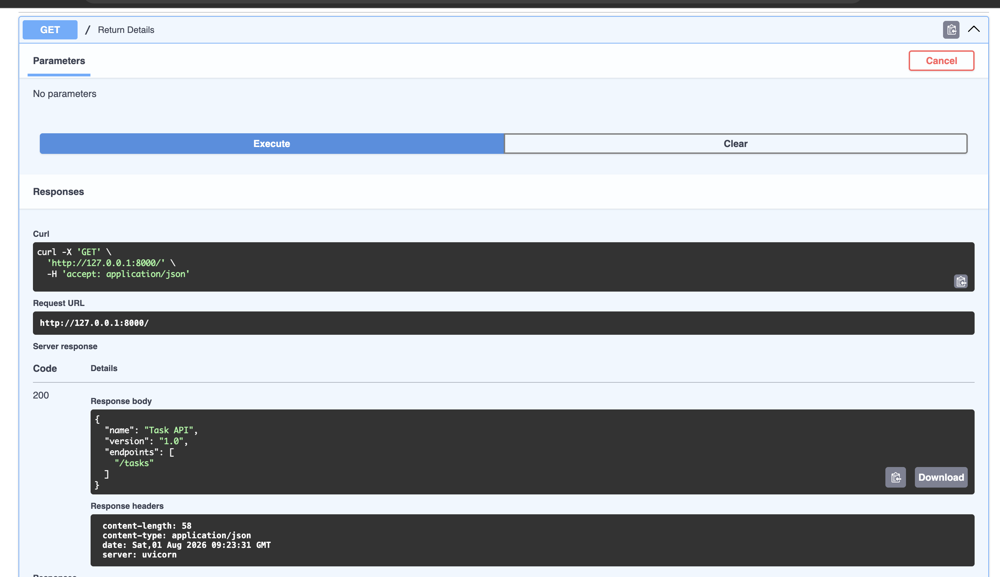

# assignment1_backend

A small FastAPI backend for managing a simple in-memory task list (a to-do API). Tasks live in a Python list in memory, so they reset whenever the server restarts.

## Install & Run

```bash
pip install fastapi uvicorn && uvicorn main:app --reload
```

The API will be available at `http://127.0.0.1:8000`, with interactive docs at `http://127.0.0.1:8000/docs`.

## Endpoints

| Method | Endpoint          | Description                        |
|--------|-------------------|-------------------------------------|
| GET    | `/`               | Basic API info                     |
| GET    | `/tasks`          | Get all tasks                      |
| GET    | `/tasks/{req_id}` | Get a single task by ID             |
| POST   | `/tasks/`         | Create a new task                   |
| PUT    | `/tasks/{req_id}` | Update a task's title/done status   |
| DELETE | `/tasks/{req_id}` | Delete a task by ID                 |
| GET    | `/health`         | Health check                        |

## Example Request

```
curl -i 'http://127.0.0.1:8000/'
```

```
HTTP/1.1 200 OK
date: Sat, 01 Aug 2026 09:23:31 GMT
server: uvicorn
content-length: 58
content-type: application/json

{"name":"Task API","version":"1.0","endpoints":["/tasks"]}
```

## Docs Screenshot

Interactive Swagger docs at `/docs`, showing the `GET /` endpoint:


